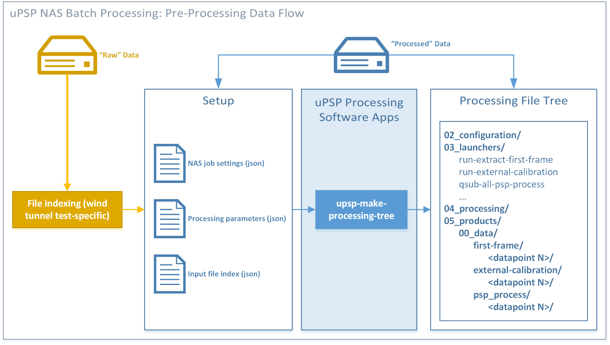

---
title: Unsteady Pressure-Sensitive Paint (uPSP) Data Processing Software User Manual
tablenos-number-by-section: true
xnos-capitalise: true
xnos-warning-level: 1
author:
- Marc A. Shaw-Lecerf
- Jessie Powell
...

# Introduction

The following document contains information needed to use the
Unsteady Pressure-Sensitive Paint (uPSP) data processing software.

Instructions are provided for:

- Accessing pre-built software releases
- Configuring and running the software
- Reading and interpreting output files

Detail description of algorithms and software implementation are provided elsewhere in the uPSP Software Design Description (SwDD).

For updates to this user manual, unexpected software behavior, or any other questions or troubleshooting, please contact Nettie Roozeboom (nettie.roozeboom@nasa.gov).

# Terminology

- **Data point**: A single wind tunnel test condition
- **External calibration**: Also called "extrinsic" calibration; parameters that quantify the position and orientation of a camera coordinate frame relative to another frame (for example, relative to a test model-fixed frame or a wind tunnel-fixed frame)
- **Internal calibration**: Also called "intrinsic" calibration; parameters that quantify the physical properties of the camera system such as focal length and sensor center offset.
- **Javascript Object Notation (JSON)**: Text-based file format used for storage of structured data, used throughout uPSP software for configuration files.
- **Outer Mold Line (OML)**: The wetted surface area of an aerodynamic body (to be painted with PSP)
- **NASA Advanced Supercomputing Division (NAS)**: Division at NASA Ames Research Center that houses the HECC.
- **Pleaides Front End (PFE)**: Systems in the NAS HECC enclave for user login to interact with the HECC clusters.
- **Portable Batch Scheduler (PBS)**: System service that handles scheduling jobs on NAS HECC clusters.
- **Wind Tunnel Data (WTD) file**: File format for storage of wind tunnel test conditions such as Mach number, Reynolds number, model angle of attack, model sideslip angle, and model sting support position.
- **Wind tunnel test model ("test model", or "model")**: The physical body installed in the wind tunnel for test purposes
- **Wind tunnel test model grid ("model grid", or "grid")**: The 3D representation of a wind tunnel test model in a digital file format

# How to get access to software releases {#sec:sw-access}

Pre-built uPSP software (binaries, scripts, and documentation) are available in a folder on a shared network drive within the NASA Advanced Supercomputing Division (NAS) enclave.

- Users need a NAS account and should be familiar with accessing Linux-based NAS systems, in particular, the Pleiades cluster front-end nodes ("PFEs") and the Portable Batch Scheduler (PBS). Visit the [NAS HECC Knowledge Base](https://www.nas.nasa.gov/hecc/support/kb/) or email the NAS support desk (support@nas.nasa.gov) to learn more.
- Once you have access to the NAS enclave, contact Nettie Roozeboom (nettie.roozeboom@nasa.gov) for access to the uPSP release shared folder (`/swbuild/upsp/builds`)

Once you have access to the release folder:

1. Log into a `pfe` system using your NAS account
1. List the contents of `/swbuild/upsp/builds` and find the build you want to use by version number
1. Source the script `/swbuild/upsp/builds/<version>/activate.sh` (for `bash` users) or `/swbuild/upsp/builds/<version>/activate.csh` (for `csh` users). This will set up your environment (including your `PATH`) to run the uPSP software applications in this versioned build folder.
    - The command to source `activate.sh` (or `activate.csh`) can be placed in your user environment setup to be run automatically on login (reference HECC article ["Customizing Your Unix Environment"](https://www.nas.nasa.gov/hecc/support/kb/customizing-your-unix-environment_258.html))
1. To check: run `which psp_process` and verify the path to `psp_process` is in the desired build folder.

# What is in the software release

The uPSP software includes a set of applications to process high-speed video recordings of the surface of a wind tunnel test model covered in pressure-sensitive paint. It also includes a scripting framework to batch process many wind tunnel test conditions leveraging the NAS HECC facility. The entire chain of processing steps is commonly referred to as the processing "pipeline." Each pipeline application can be called individually by the user or indirectly using batch processing tools.

The uPSP software release is organized as follows:

- `bin/`: Executable binaries and scripts
- `lib/`: Shared libraries used by binaries
- `docs/`: Documentation (including this user manual)
- `python/`: Python packages/modules used by scripts

The primary pipeline applications are in `bin/`:

1. `upsp-extract-frames`: Dump individual frames from, or transcode video format of, high-speed camera video files.
    - Currently, the code supports Photron (\*.mraw/\*.cih) and Phantom Vision (\*.cine) formats.
1. `upsp-external-calibration`: Compute external camera calibration relative to the model position and orientation as viewed in a single camera frame
    - The first frame from each video file (dumped using `upsp-extract-frames`) is used to calibrate each camera's positioning relative to the model at the start time of the test condition
1. `psp_process`: Project image pixel values from each video frame onto a 3D, gridded representation of the wind tunnel test model surface, and convert into surface pressure values
    - Pixel values are combined in areas where multiple cameras can see the model
    - The output of `upsp-external-calibration` is used to initialize the projection
    - Any additional motion of the model in subsequent frames is handled using image alignment that "warp" the image to align with the first frame.

The release also includes:

- `activate.{sh,csh}`: Scripts to source to setup user environment for running uPSP apps.
- `upsp-make-processing-tree`: Main entry point for batch processing setup
- `upsp-kulite-comparison`: Utility to export uPSP pressure time series nearby Kulites on the model surface
- `add_field`, `upsp-plotting`, `xyz_scalar_to_tbl`: Helper routines used as part of batch processing scripts (not intended to be run directly by users)

The next section provides steps to get up-and-running ("Quick Start"); then, more detail is provided about the inputs and outputs of each pipeline application.

# Quick Start

In general, a user can run the uPSP software in using one of two methods:

- **Processing one test condition**: Useful for initial checkout of raw data from a wind tunnel test setup. The user manually runs each step in the pipeline.
- **Batch processing multiple test conditions**: Useful after initial checkout. A framework auto-generates scripts that will invoke each pipeline step for each wind tunnel test condition. The user controls the pipeline via top-level "launcher" scripts.

## Producing surface pressure time history for one test condition {#sec:single-processing}

The following instructions allow a user to process a single test conditions with the uPSP software using the NAS PFE systems. The steps will use bracketed shorthand like `<name>` to refer to the path to input files on disk. See +@sec:file-formats for more details about input file formats.

1. Acquire the following input files and save them to locations accessible by a PFE system.
   - `<video-file>`: High-speed video recording of your test subject (+@sec:video-file)
   - `<grid-file>`: Test model grid file (+@sec:grid-file)
   - `<tgts-file>`: Registration targets and fiducials (+@sec:tgts-file)
   - `<steady-file>`: Steady-state surface pressure file (+@sec:steady-file)
   - `<wtd-file>`: Wind Tunnel Data (WTD) file (+@sec:wtd-file)
   - `<paint-file>`: Unsteady gain paint calibration coefficients (+@sec:paint-file)
   - `<cal-file>`: Camera calibration parameters (one file per camera) (+@sec:cal-file)
2. Create the following processing configuration files and save them to locations accessible by a PFE system.
   - `<inp-file>`: Input deck for `psp_process` (+@sec:input-deck)
   - `<excal-cfg-file>`: Algorithm parameters for external camera calibration (+@sec:excal-file)
3. Log into a NAS `pfe` system and activate the uPSP software (see +@sec:sw-access).
4. Run `upsp-extract-frames`. This dumps the first frame from the camera video file.

    ```bash
    #!/bin/bash
    upsp-extract-frames \
      -input=<video-file> \
      -output=first-frame.png \
      -start=1 \
      -count=1
    ```

    Run `upsp-extract-frames -h` for more usage details.

    The output file `first-frame.00001.png` contains the first frame from the input `<video-file>`, scaled to 8-bit depth.

4. Run `upsp-external-calibration`. This computes the external camera calibration relative to the model position in the first frame --- this step accounts for "wind-on" deflection.

    ```bash
    #!/bin/bash
    upsp-external-calibration \
      --tgts <tgts-file> \
      --grd <grid-file> \
      --wtd <wtd-file> \
      --cfg <excal-cfg-file> \
      --cal_dir <cal-dir> \
      --out_dir . \
      --img first-frame.00001.png
    ```

    `<cal-dir>` refers to the name of the directory containing `<cal-file>`. Run `upsp-external-calibration -h` for more usage details.

    The output file `cam01-to-model.json` contains the external calibration parameters, and will be fed to `psp_proces` in the next step.

5. Start a PBS session (see +@sec:nas-parameters for more details) and run `psp_process` to produce a (usually quite large) time history of the surface pressure at each point on the model grid.

    ```sh
    #!/bin/bash
    export MPI_DSM_DISTRIBUTE=off
    export OMP_STACKSIZE=250M
    export OMP_NUM_THREADS=16
    module purge
    module load mpi-hpe/mpt.2.25
    mpiexec psp_process \
      -input_file=<inp-file> \
      -h5_out=<out-dir>/output.h5 \
      -paint_cal=<paint-file> \
      -steady_p3d=<steady-file>
    ```

    `<out-dir>` refers to the value of the `@output/dir` variable specified in the `<inp-file>`. Run `psp_process -h` for more usage details (note that `psp_process -h` must also be run from inside a PBS session; the HECC systems will not allow an MPI application to be run from any of the frontend systems).
    
    The output `pressure_transpose` file contains the surface pressure time history for each node on the model grid. Several diagnostic images are printed to verify the external calibration and (optional) fiducial patches align well with the position of the model in the first video frame

6. (Optional) post-processing steps
   - Run `add_field` to add the `pressure_transpose` data into the HDF5 file produced by `psp_process`. For some of its command line arguments, `add_field` must be provided with the number of vertices in the 3D model and the number of frames that were processed. Example usage below shows how to obtain these values from inspecting files output by `psp_process` in the BASH script language. `<out-dir>` should be replaced with the same directory as `<out-dir>` in the previous step (the directory containing outputs from `psp_process`).

        ```bash
        #!/bin/bash

        # Set output_dir to the folder containing outputs from `psp_process`
        # in previous step.
        output_dir=<out-dir>
        trans_h5_file=$output_dir/output.h5

        # Inspect the 'X' file, which is a flat binary dump of the
        # X-coordinates of the input wind tunnel model grid vertices.
        # The number of coordinates in the file gives the size of the model.
        data_item_size=4 # coordinates stored as 4-byte float's
        model_size="$(expr $(stat --printf="%s" $output_dir/X) '/' $data_item_size)"
        trans_flat_file="$(find $output_dir -type f -name 'pressure_transpose')"
        trans_flat_file_size="$(stat --printf="%s" $trans_flat_file)"
        trans_flat_file_number_frames="$(expr $trans_flat_file_size '/' '(' $model_size '*' $data_item_size ')')"

        echo ">>> number of model nodes: $model_size"
        echo ">>> data item size: $data_item_size"
        echo ">>> time history flat file: '$trans_flat_file'"
        echo ">>> time history flat file size: $trans_flat_file_size"
        echo ">>> time history flat file number of frames: $trans_flat_file_number_frames"
        echo ">>> adding flat-file data to '$trans_h5_file'"
    
        ex="add_field $trans_h5_file frames $trans_flat_file $trans_flat_file_number_frames"
        echo ">>> running: '$ex'"
        t_start="$(date +%s.%N)"
        echo ">>> started at: $(date)"
        $ex
        t_end="$(date +%s.%N)"
        echo ">>> elapsed time: $(python -c "print('%4.1f' % ($t_end - $t_start))") seconds"
    
        echo ">>> run-add-field DONE."
        ```

## Batch processing multiple test conditions {#sec:batch-processing}

The following instructions allow a user to batch process one or more test conditions from a wind tunel test with the uPSP software. The instructions assume the user would like to run the uPSP software at the NAS and that the user has access to the NAS Pleaides Front End (PFE) systems.

Batch processing is configured by `upsp-make-processing-tree`, a tool that auto-generates a file tree and associated command-line scripts that the user can then run to execute each step in the uPSP pipeline for one or more datapoints. The configuration process is illustrated in +@fig:flowchart and consists of the following steps:

1. The user locates raw data files from a wind tunnel test on disk at the NAS.
2. The user prepares four Javascript Object Notation (JSON) configuration files:
    - A **datapoint index**, listing the path to each raw input file for each datapoint
        - This often consists of writing test-specific scripts/tools to find each input file on disk
    - A **processing parameters file**, containing parameter settings for each step in the pipeline
    - A **NAS job parameters file**, containing NAS PBS scheduler settings (group ID, reservation wall time, number of nodes, etc.)
    - A **plotting parameters file**, containing parameters for plotting steps in the pipeline
3. The user runs `upsp-make-processing-tree` and provides it with each configuration file. The script will autogenerate a file tree on disk to store all artifacts for batch processing
4. The user can run scripts in the `03_launchers` sub-folder of the file tree to execute steps in the pipeline for all datapoints.

The JSON file format was chosen for batch processing configuration files due to its ubiquitous usage in industry and broad cross-platform/cross-language support. Users should be familiar with plain-text editing of JSON files and can reference the official JSON syntax [here](https://www.json.org/json-en.html).

{#fig:flowchart width=100%}

The following is a step-by-step procedure for configuring batch processing, including example configuration file snippets:

1. Log into a NAS pleaides frontend and activate a version of the uPSP software
   as described previously in +@sec:sw-access.
2. Prepare batch processing configuration files (JSON format; syntax reference [here](https://www.json.org/json-en.html)). See +@sec:batch-processing-file-formats for examples/details.

    - Datapoint index
    - Processing parameters file
    - NAS job parameters file
    - Plotting parameters file
3. Run `upsp-make-processing-tree -h` for usage, then call with command-line
   arguments set to read the three config files just previously created.
4. Verify a folder tree is created in the given output location. Find a subdirectory named `03_launchers` and navigate into it.
5. Each step in the pipeline is launched using a script named `step+<step-name><+optional-subtask-name>`.
    - They should be run in the order given here (some steps use outputs from previous steps):
        1. `step+extract-first-frame`: extract the first frame from each camera video file.
        2. `step+external-calibration`: run the wind-on, first-frame external calibration for each camera.
        3. `step+psp_process+psp-process`: run `psp_process` - image-to-grid projection and calibration to units of pressure.
        4. `step+psp_process+add-field`: post-process `psp_process` outputs; add largest pressure-time history dataset into the HDF5 output file.
    - Each step launcher script can be invoked as follows:
        - `./<step-launcher-script> <datapoint-id-1> <datapoint-id-2> ...` to process a specific subset of datapoints. By default, all datapoints are processed.
        - `./qsub-step <step-launcher-script> <datapoint-id-1> <datapoint-id-2> ...` to launch the step on the cluster as one or more jobs (uses `qsub`). The jobs can then be monitored using `qstat -u $USER`. The jobs are configured using the NAS job parameters supplied in the NAS job parameters file.
        - **Note**: All steps can be run from a frontend, or submitted to the cluster with `qsub-step`, with the exception of `step+psp_process+psp-process`, which MUST be run as a cluster job (it makes use of MPI, which is only allowed on cluster nodes).
6. Once complete, data products for each datapoint will be available under `04_products/00_data/<step-name>/<datapoint-id>`.

## Guidelines for setting NAS PBS job parameters {#sec:nas-parameters}

See the HECC wiki, ["Running Jobs with PBS"](https://www.nas.nasa.gov/hecc/support/kb/running-jobs-with-pbs-121/).

# Pipeline application details {#sec:application-details}

The following sections explain in more detail the inputs and outputs of each pipeline application. Running each application with the `-h` option will provide brief usage instructions to `stdout` as well.

## `upsp-extract-frames`

The `upsp-extract-frames` application is a utility to dump high-speed camera video frames to "friendlier" formats. Video frames can be output to common image formats (e.g., jpg, png) or video formats (e.g., avi, mp4).

## `upsp-external-calibration`

The `upsp-external-calibration` application locates model targets in the first frame, then finds the position and orientation of the wind tunnel model relative to the camera using photogrammetry techniques.

## `psp_process`

The majority of "computational heavy lifting" is performed by the `psp_process` application. Conceptually, the processing is split into three steps:

- **Initialization**: Video files are opened; first-frame camera calibration parameters are loaded from file; fiducial patching is initialized (see +@sec:fiducial-patching); diagnostic images for each camera are saved; first-frame image-to-grid projections are initialized
- **Phase 1**: For each time step, pixel ("intensity") data from each camera frame is projected to its corresponding vertex of the model grid. Intensity data from multiple cameras are combined.
- **Phase 2**: The intensity time series at each grid vertex is detrended and converted to a surface pressure measurement, using the provided unsteady gain calibration and the reference steady-state pressure.

For more detail on the algorithms used in each step, please see the uPSP SwDD.

### Fiducial Patching {#sec:fiducial-patching}

In many cases, wind tunnel test models will have surface area not covered by pressure-sensitive paint. Particularly troublesome cases are small regions within larger painted areas, referred to as "fiducials." Example fiducials could be:

- masking tape to protect transducer heads from paint spray (often circular regions around a transducer head)
- unpainted points on the model used for wind-on external calibration by `upsp-external-calibration`
- fasteners used to add/remove portions of test model between runs
- oil stains from lubrication of test model articles

While larger regions can be excluded manually from downstream analysis, these smaller areas are much harder to manually exclude. In this case, `psp_process` can automatically "patch" over known fiducial points on the model if they are provided in the input `tgts` file. The position and diameter of the fiducial must be supplied; a patch is applied in the image plane prior to projecting to the model grid, where the patched pixels are replaced by a 3rd-order, 2D-interpolation of the patch boundary pixels. For fiducials that are closely-spaced such that their patches would overlap, one larger patch is applied to the set of fiducials (to cover use cases such as a shock array of closely-spaced transducer heads on the model in a streamwise line). Diagnostic images written out by `psp_process` include an example of the patching output for the first frame from each video file, and can be used to manually tune the patch algorithm parameters for best performance on a per-wind-tunnel-test basis.

# File formats {#sec:file-formats}

The following section describes in detail various file formats used throughout the uPSP processing pipeline.

## High-speed camera video file {#sec:video-file}

The uPSP software supports the following vendor-specific files:

- CINE files (from Phantom Vision cameras)
- MRAW/CIH files (from Photron cameras)

In particular, the software is tested primarily with monochannel, "12-bit packed" images. Other packing strategies are supported but are less commonly used.

## Grid definition file {#sec:grid-file}

The uPSP software requires an accurate definition of the wind tunnel model wetted surfaces. It currently supports two file formats, auto-detected based on file extension:

- `*.g`, `*.x`, `*.grid`, `*.grd`: PLOT3D structured grid
- `*.tri`: Cart3D unstructured grid

The following subsections provide more detail for each grid file format.

### PLOT3D file formats {#sec:plot3d}

PLOT3D is a computer graphics program (written at NASA) to visualize the grids and solutions of computational fluid dynamics (User Manual can be found online [here](https://ntrs.nasa.gov/citations/19900013774)). The program defined several file formats that are now industry standard; in particular, refer to "Chapter 8: Data File Formats."

The uPSP software uses the following file formats that are part of the PLOT3D standard:

- 3D Grid XYZ file (`*.grd`, `*.x`, `*.g`) (PLOT3D User Manual, Section 8.2)
  - Unformatted FORTRAN (binary, and contains leading- and trailing- 32-bit record separators)
  - Multi-grid
  - Single precision
  - No IBLANKS
- 3D Function file (`*.p3d`, `*.f`) (PLOT3D User Manual, Section 8.4)
  - Unformatted FORTRAN (binary, and contains leading- and trailing- 32-bit record separators)
  - Multi-grid
  - Single precision
  - Assumes only one scalar variable per vertex (in user manual, `NVAR=1`)

Note that the uPSP software does *not* ingest solution files (`*.q`), which normally contain values for the full flow variable solution at each grid point. Solution files are more commonly produced by CFD solvers and are occasionally confused with function files.

### Cart3D file formats {#sec:cart3d}

Cart3D is a high-fidelity inviscid analysis package (written at NASA) for conceptual and preliminary aerodynamic design (Online reference [here](https://www.nas.nasa.gov/publications/software/docs/cart3d/)). The package defined several file formats that are now industry standard; refer [here](https://www.nas.nasa.gov/publications/software/docs/cart3d/pages/cart3dTriangulations.html) for detailed file format descriptions.

The uPSP software uses the following file formats that are a part of the Cart3D standard:

- Surface triangulations (`*.tri`) for 3D surface geometry definition
- Annotated triangulations (`*.triq`) for scalar values defined over a surface triangulation

## Targets file {#sec:tgts-file}

In addition to a specification of the model surface geometry, the uPSP software must be provided a file that specifies:

- The 3D position and normal for keypoints on the model surface, known as targets
  - These keypoints must be dark regions on the model surface where paint was either not applied to purposefully darked with a stain
- Circular features (position + diameter) on the model where paint is not present or is damaged

The targets locations must be outside the model grid by a distance of 1e-5 +/- 5e-6 inches.

The file format is commonly called the "targets" file and is defined by the DOTS application, a steady-state PSP solver application used at NASA, but should be modified to ensure the targets are consistent with the grid file. An example is included below.

Targets File Example:
```
#   x            y           z           normal x  normal y  normal z size  i    j   k   name
1   67.02449799  3.17536973 -2.70057420  0.000000  0.762017 -0.647557 0.433 596  21  55  st6
2   66.52809906  2.83113538  3.05953808  0.000000  0.678209  0.734869 0.433 596  85  50  st7
3   79.28500366  7.62883166 -1.21192827  0.000420  0.742280 -0.670089 0.433 2261 160 26  st8
4   79.03060150  7.57744602  1.26724449 -0.000430  0.718970  0.695040 0.433 2261 20  23  st9
5   81.26619721  2.67079590  3.20469503  0.000000  0.641469  0.767148 0.433 716  29  25  st10
6   95.46779633  7.70066046  1.12676893  0.000000  0.786289  0.617859 0.433 2260 17  30  st11
7   98.17250061  2.85770474  3.03950497  0.000000  0.677413  0.735603 0.433 716  189 27  st12
8  110.63110352  7.77465312  1.02533593  0.000000  0.826620  0.562760 0.433 2260 15  224 st13
```

## Steady-state PSP solution file {#sec:steady-file}

The uPSP software requires a reference, steady-state surface pressure at each grid point in order to compute the unsteady fluctuating pressure. It supports the following file formats for ingesting steady-state pressure data, auto-detected by file extension. It is also dependent on the format used for the model grid file.

- PLOT3D function file (`*.f`, `*.p3d`) if the model grid is PLOT3D structured
- Cart3D annotated triangulation (`*.triq`) if the model grid is Cart3D unstructured

See +@sec:plot3d and  +@sec:cart3d for more details about the PLOT3D and Cart3D file formats, respectively. In both formats, the scalar values should be provided as values of the coefficient of pressure ($C_p$).

## Wind Tunnel Data (WTD) file {#sec:wtd-file}

The external calibration application requires a snapshot of the model position for a datapoint to use as a wind-off reference. It can be generated by the UPWT, and must contain the following:

- STRUTZ_UNC: Uncorrected strutz position
- ALPHA: Model pitch angle
- BETA: Model sideslip angle
- PHI: Model roll angle

The model angles are the corrected angles output from the SDS sytem. These correct for additional bending due to deflection of the sting and model mounting system.

WTD File Example:
```
# MACH     ALPHA     BETA     PHI        STRUTZ_UNC
  0.838751 -0.041887 0.011826 -90.000000 3.012192
```

<!---
todo-ncalifan UPWT doc reference?
-->

## Unsteady gain paint calibration file {#sec:paint-file}

The uPSP software requires a pre-computed calibration for converting intensity ratios from camera pixel values into physical units of pressure.

The calibration has 6 coefficients (`a`, `b`, `c`, `d`, `e`, `f`) that should be provided in a text file, example as follows:

```txt
a = 1.1
b = 2.2
c = 3.3
d = 4.4
e = 5.5
f = 6.6
```

See the uPSP SwDD for details about how these coefficients are used mathematically in the intensity-to-pressure conversion process.

## Camera-to-tunnel calibration file {#sec:cal-file}

The camera-to-tunnel calibration file contains the intrinsic camera parameters as well as the extrinsic camera parameters relative to the tunnel origin. It is a JSON file with the following elements:

- uPSP_cameraMatrix: Camera Matrix formatted as [[f, 0, dcx], [0, f, dcy], [0, 0, 1]], where f is the focal length (in pixels), and (dcx, dcy) is the vector in pixel space from the image center to the principal point.
- distCoeffs: OpenCV 5 parameter lens distortion coefficients formatted as [k1, k2, p1, p2, k3]
- rmat: rotation matrix from camera to tunnel
- tvec: translation vector from camera to tunnel

Optional:

- sensor_resolution: Camera sensor resolution
- sensor_size: Camera sensor physical size
- Updated: Date of last update to this file

## `psp_process` Input Deck {#sec:input-deck}

The input deck file was designed to coordinate most of the inputs and options needed for `psp_process`. It is also a good reference for which files influenced the final processed results. Descriptions of all of the variables included in the input deck are included in +@tbl:input-deck.

```
@general
	test = t11-0344
	run = 1312
	sequence = 01
	tunnel = ames_unitary
@vars
	dir = /nobackup/upsp/program/test_number
@all
	sds = $dir/inputs/131201.wtd
	grid = $dir/inputs/config28.grid
	targets = $dir/inputs/config28.tgts
	normals = $dir/inputs/config28_normals.csv
@camera
	number = 1
	cine = $dir/inputs/13120101.cine
	calibration = $dir/inputs/cam01-to-model.json
	aedc = false
@camera
	number = 2
	filename = $dir/inputs/13120102.mraw
  calibration = $dir/inputs/cam02-to-model.json
	aedc = false
@options
	target_patcher = polynomial
	registration = pixel
	overlap = best_view
	filter = gaussian
	filter_size = 3
	oblique_angle = 70
	number_frames = 2000
@output
	dir = $dir/outputs
```

Table: `psp_process` input deck parameter descriptions. {#tbl:input-deck}

| Section | Variable | Description | Required? | How it is used
| :-----: | :------: | :---------- | :-------: | :-------------
| General | | | |
| | test | test id number | yes | included in output HDF5 files
| | run | run number | yes | included in output HDF5 files
| | sequence | sequence number | yes | included in output HDF5 files
| | tunnel | tunnel identifier | yes | used for determining which tunnel transformations and input files to expect, only currently support `ames_unitary`
| Vars | | allows variables to be set for use within the file | no | any variable can be used anywhere else in the file when preceeded with `$`, it will be replaced with the value when processed
| All | | | |
| | sds | wind tunnel data (WTD) file | yes | many variables are included in the output HDF5 files; used to determine the orientation of the model for calibration; used as part of converting camera intensity to pressure
| | grid | grid file | yes | will be the basis of the projection from the image plane into space, data will be stored, when available, at each grid node
| | targets | targets file | yes | targets: used to correct the calibration for this data point; targets and fiducials: patched over by the target patcher
| | normals | grid vertex normals override | no | allows for individually setting the normal direction for individual grid nodes, used as part of projection, useful for non-watertight structured grids
| Camera | | | | need a block per camera that will be processed
| | number | camera id number | yes | used to match cine files to the correct camera calibration, should not have duplicate camera numbers
| | cine | cine file | yes | path to the camera video file that will be processed (deprecated; prefer "filename" key instead)
| | aedc | aedc cine file type flag | no | aedc format is different than other cine file formats, so it is used to read the cine file; default is false
| | filename | video file | yes | path to the camera video file. Supported extensions: \*.mraw, \*.cine. For \*.mraw, the \*.cih header file must be a sibling file of the \*.mraw file with the same basename, e.g., `video-01.mraw` and `video-01.cih`.
| | calibration | model-to-camera external calibration file | yes | path to external camera calibration file (output from `upsp-external-calibration`; calibration of camera frame relative to position of wind tunnel model in the first frame of the camera video file).
| Options | | | |
| | target_patcher | type of target patching | no | decide what type of target patching is implemented, supports either `polynomial` or `none`; default is `none`
| | registration | image registration type | no | decide what type of image registration to perform, supports either `pixel` or `none`; default is `none`
| | overlap | multi-view handling | no | specify how to handle points that are visible from multiple cameras, supports either `best_view` or `average_view`; default is `average_view`
| | filter | image plane filtering | no | decide what type of filtering to apply to each image prior to projection, supports either `gaussian` or `none`; default is `none`
| | filter_size | size of the filter | yes | decide how large the filter will be in pixels, must be odd
| | oblique_angle | minimum projection angle | no | minimum angle between grid surface plane and camera ray to be considered visible by the camera; default 70 (degrees)
| | number_frames | number of frames to process | yes | number of camera frames to process
| Output | | | |
| | dir | output directory | yes | destination directory for output files

## External camera calibration parameters file {#sec:excal-file}
<!---
todo-mshawlec (todo-ncalifan): Update this, and references to it to describe how this is done via was of upsp-make-processing-configs and are stored in proc*.json>
-->

The external calibration application requires a set of configuration parameters. These parameters are mainly static parameters related to the tunnel, model setup in the tunnel, or hyper parameters related to the external calibration process. This input is stored as a JSON with the following elements:

- oblique_angle: Oblique viewing angle for target visibility checks
- tunnel-cor_to_tgts_tvec: Tunnel center of rotation to targets frame translation vector
- tunnel-cor_to_tgts_rmat: Tunnel center of rotation to targets frame rotation matrix
- tunnel-cor_to_tunnel-origin_tvec: Tunnel center of rotation to tunnel origin translation vector
- tunnel-cor_to_tunnel-origin_rmat: Tunnel center of rotation to tunnel origin rotation matrix
- dot_blob_parameters: Blob detection parameters to find sharpie targets
- dot_pad: Sharpie target padding distance for sub-pixel localization
- kulite_pad: Kulite target padding distance for sub-pixel localization
- max_dist: Maximum matching distance between a wind-off target position and a detected target
- min_dist: Minimum distance between two targets before they become too close and ambiguous

Optional:

- Updated: Date of last update to this file

## Batch processing configuration files {#sec:batch-processing-file-formats}

### Datapoint index

Example:

```json
{
  "__meta__": {
    "config_name": "<string: alias for this index file, e.g., 'default'>",
    "test_name": "<string: alias for the wind tunnel test name, e.g., 't11-0377' for UPWT 11ft tests>"
  }
  "<string: unique datapoint ID number, e.g., '301401'>": {
    "camera_tunnel_calibration_dir": "<string: directory containing camera-to-tunnel calibration files>",
    "camera_video_dir": "<string: path to directory containing camera video files>",
    "grid_file": "<string: path to 3D model grid file>",
    "kulites_files_path": "<string: path to folder containing kulite *.slow, *.fast, *.info files>",
    "normals_file": "<string (optional): path to grid normals override file>",
    "paint_calibration_file": "<string: path to uPSP unsteady gain calibration file>",
    "steady_psp_file": "<string: path to steady-state PSP PLOT3D function file>",
    "targets_file": "<string: path to targets file containing registration targets and fiducials>",
    "wtd_file": "<string: path to wind tunnel data file>"
  }
}
```
    
- Each input file is described in more detail in +@sec:file-formats.
- In the case of `*.mraw`-formatted camera video files, it is assumed that the corresponding `*.cih` video header file is a sibling of the `*.mraw` file in the same folder, with the same name (e.g., `12345601.mraw` and `12345601.cih`).

### Processing parameters file

The processing parameters file is a single location for the user to specify parameter values for all applications in the processing pipeline.

The file is structured to allow the user to specify a set of default values as well as one or more "overlays" to customize parameter values for individual datapoints or for sets of datapoints that share common characteristics. The customization makes use of a series of regular expressions, in particular, using Python-format syntax (see [here](https://docs.python.org/3/library/re.html#regular-expression-syntax)).

Example:

```json
{
  "__meta__": {
    "name": "<string: alias for these parameter settings, e.g., 'default'>"
  },
  "processing": {
    "defaults": {
      "psp_process": {
        "cutoff_x_max": 120,
        "filter": "none",
        "filter_size": 1,
        "number_frames": 20,
        "oblique_angle": 70,
        "registration": "pixel",
        "target_patcher": "polynomial"
      },
      "external-calibration": {
        "Updated": "07/27/2021",
        "dot_blob_parameters": [
          ["filterByColor", 1],
          ["filterByArea", 1],
          ["filterByCircularity", 1],
          ["filterByInertia", 1],
          ["filterByConvexity", 1],
          ["thresholdStep", 1],
          ["minThreshold", 13],
          ["maxThreshold", 40],
          ["minRepeatability", 4],
          ["minDistBetweenBlobs", 0],
          ["blobColor", 0],
          ["minArea", 4],
          ["maxArea", 24],
          ["minCircularity", 0.72],
          ["maxCircularity", 0.95],
          ["minInertiaRatio", 0.25],
          ["maxInertiaRatio", 1.01],
          ["minConvexity", 0.94],
          ["maxConvexity", 1.01]
        ],
        "dot_pad": 4,
        "image_dims": [512, 1024, 1],
        "kulite_pad": 3,
        "max_dist": 6,
        "min_dist": 10,
        "model_length": 87.1388,
        "oblique_angle": 70,
        "sensor_resolution": [800, 1280, 1],
        "sensor_size": [0.8818898, 1.4110236],
        "sting_offset": [-195.5125, 0, 0],
        "tgts_transformation_rmat": [
          [1, 0, 0],
          [0, 1, 0],
          [0, 0, 1]
        ],
        "tgts_transformation_tvec": [-32.8612, 0, 0],
        "tunnel-cor_to_tgts_tvec": [-195.5125, 0, 0]
      }
    },
    "config123": {
      "external-calibration": {
        "model_length": 123.456
      }
    },
    "__overlays__": [
        ["defaults", {".*": ".*"}],
        ["config123", {"grid_file": ".*config123.*"}]
    ]
  }
}
```

Each child of `"processing"` NOT named `__overlays__` specifies some/all parameter values for some/all applications in the pipeline, and is referred to here as a "parameter set". Each parameter set is given a name, for example, `"defaults"` or `"config123"` in the above file. Each parameter set need not specify every available application parameter; in the example above, `"defaults"` contains a full specification, whereas `"config123"` contains a specific value just for the `"model_length"` parameter of the `"external-calibration"` pipeline application. In general, all parameter names map to corresponding parameters that can be supplied directly to each pipeline application when running them manually/individually. See +@sec:application-details for detailed documentation of each pipeline application.

The `__overlays__` section specifies how to use the parameter sets to configure each datapoint. The user must provide a list of overlay entries, each in the format `[<name>, <patterns>]`. Each datapoint matching the contents of `<patterns>` will use the parameter values given by the parameter set named `<name>`. Overlays are applied in the order listed, so in the example above, the `config123` parameter set will override any values already specified in `defaults`. The usage of `<patterns>` for matching a datapoint is as follows:

- `<patterns>` is a dictionary where each key `k` and each value `v` are regular expression strings (Python-format)
- For each entry in `<patterns>`, and for each input in the index JSON (`grid_file`, `targets_file`, etc.)
    - If the input key matches the regular expression given by `k`, then
    - The input value is tested against the regular expression given by `v`.
- If all tests pass for all entries in `<patterns>`, then the datapoint "matches."

### NAS job parameters file

Example:

```json
{
  "__meta__": {
    "name": "<string: alias for these NAS settings, e.g., 'default'>"
  },
  "nas": {
    "__defaults__": {
      "charge_group": "<string: UNIX group id, e.g., 'g1234'>",
      "node_model": "<string: NAS node mode, e.g., 'ivy'>",
      "queue": "<string: NAS job queue name, e.g., 'normal'>",
      "number_nodes": "<integer: number of NAS nodes for processing, e.g., 10>",
    },
    "external-calibration": {
      "launcher": "parallel",
      "wall_time": "<string: wall clock time to run this step, per data point, e.g., '00:10:00'>"
    },
    "extract-first-frame": {
      "launcher": "parallel",
      "wall_time": "<string: wall clock time to run this step, per data point, e.g., '00:10:00'>"
    },
    "psp_process": {
      "launcher": "serial",
      "number_nodes": "<integer: number of NAS nodes for processing, e.g., 40>",
      "wall_time": "<string: wall clock time to run this step, per data point, e.g., '00:10:00'>"
    },
    "render-images": {
      "launcher": "parallel",
      "wall_time": "<string: wall clock time to run this step, per data point, e.g., '00:10:00'>"
    }
  }
}
```

Each step in the pipeline should be assigned a full set of NAS job parameters. A set of `__defaults__` will apply to all steps, and then optional overrides can be provided in a section named for each step. The job parameters are used by `qsub-step` to launch step jobs on the NAS cluster nodes, and are tuned primarily by the number of vertices in the grid file and the number of frames in each camera video file. See +@sec:nas-parameters for more details.

### Plotting parameters file

Example:

```json
{
  "__meta__": {
    "name": "<string: alias for these plotting settings, e.g., 'default'>"
  },
  "plotting": {
    "render-images": {
      "scalars": {
        "steady_state": {
          "display_name": "Steady State",
          "contours": [-1.0, -0.8, -0.6, -0.4, -0.2, 0.0, 0.2, 0.4, 0.6, 0.8, 1.0]
        },
        "rms": {
          "display_name": "delta Cp RMS",
          "contours": [0, 0.005, 0.01, 0.015, 0.02, 0.025, 0.03]
        }
      },
      "grids": {
        "config111": {
          "views": {
            "left-side": {
              "x": 123.4, 
              "y": 123.4,
              "z": 123.4,
              "psi": 90.0,
              "theta": 0.0,
              "width": 120.0,
              "imagewidth": 1280
            },
          },
          "exclude_zones": [101, 120]
        }
      }
    },
    "generate-miniwall": {
      "variables": [
        {"name": "mach", "format": "%4.3f", "values": [0.8, 0.85, 0.9]},
        {"name": "alpha", "format": "%4.2f", "values": [0.0, 5.0, 10.0]},
        {"name": "beta", "format": "%4.2f", "values": [0.0, 5.0, 10.0]}
      ],
      "selectors": ["alpha", "beta"],
      "layout": {"cols": ["mach"], "rows": ["alpha", "beta"]},
      "site": {
        "page_name": "My MiniWall",
        "images_dir": "images",
        "model_config_prefix": "PREFIX"
      },
      "run_log": {
        "model_config": "111",
        "path": "my-run-log.txt"
      },
      "image_discovery": {
        "ext": "png",
        "patterns": {
          "datapoint": "[0-9]{6}",
          "panel_name": "[0-9][0-9]"
        },
        "cache": "lib/image_discovery.json"
      }
    }
  }
}
```

All parameters map to corresponding elements of the `upsp-plotting` configuration file. See +@sec:application-details for detailed documentation of the `upsp-plotting` application.

## Output files from `psp_process`

Output data from `psp_process` consists of $\Delta C_p$ measurements versus
time for all nodes of the user-provided wind tunnel model grid. The measurements
are provided either in raw binary format or bundled into an HDF5 file. In addition,
metadata containing the model grid definition, wind tunnel conditions, and
camera settings are bundled with the measurements in the HDF5 file.

### Pressure-time history raw binary outputs

The `psp_process` application will produce two (often large) binary files called
`pressure` and `pressure_transpose`. If using the batch processing tools
(described in +@sec:batch-processing), these files will be available in the
`output/10_other/additional_output` subdirectory for each datapoint; otherwise,
they will be available in the directory supplied to `psp_process` using the
`--add_out_dir` command line option. Both files contain the same data, however,
the formatting differs to facilitate downstream use cases.

The `pressure` binary file is formatted as follows. For a given datapoint, the
primary output data from `psp_process` is the pressure-time history, defined
as a matrix $P$ of size $[N_f \times N_m]$ where $N_f$ is the number of frames
from a uPSP camera (all cameras are synchronized, so this corresponds to the
number of time steps) and $N_m$ is the number of grid nodes. If we let
$i = 1, 2, \ldots, N_f$, and $j = 1, 2, \ldots, N_m$, then element $P_{i, j}$
corresponds to the unsteady pressure ($\Delta C_p$) measured during the
$i$'th time step at the location of the $j$'th model grid node (the ordering
of grid nodes corresponds one-to-one with the ordering in the user-supplied
model grid definition file; see +@sec:grid-file for file formats). Equivalently,
rows of $P$ correspond to snapshots of the pressure distribution over the entire
grid at each time step. The `pressure` binary file contains the matrix $P$ written
to disk in row-major format, where each value is a 32-bit, little endian, IEEE
floating point number. This corresponds to the following sequence of matrix elements:

$$
P_{1,1}, P_{1,2}, ..., P_{1,N_m}, P_{2,1}, P_{2,2}, ..., P_{2,N_m}, ..., P_{N_f,1}, P_{N_f,2}, ..., P_{N_f,N_m}
$$

Because this file can be quite large (for example, a grid with 1 million nodes
and a datapoint with 50,000 time points will have a total of 50 billion floating point
values, corresponding to approximately 186 GB), performance of file read operations can
become an issue during post-processing. It is advantageous to read contiguous
values from the file, meaning the `pressure` binary file is best suited for analyses of
the _entire_ model grid for a _subset_ of time history.

To facilitate analyses of the _entire_ time history for a _subset_ of model grid nodes,
a separate `pressure_transpose` file is also generated. It contains the values of
the _transpose_ of $P$ written to disk in a similar row-major format. This corresponds
to the following sequence of matrix elements:

$$
P_{1,1}, P_{2,1}, ..., P_{N_f,1}, P_{1,2}, P_{2,2}, ..., P_{N_f,2}, ..., P_{1,N_m}, P_{2,N_m}, ..., P_{N_f,N_m}
$$

In the `pressure_transpose` file, the time history for each individual grid node is
contiguous in memory.

The following Python code snippet demonstrates how the `pressure_transpose` flat file may
be used to obtain the time history for a single model grid node:

```python
import numpy as np
import os

def read_pressure_transpose(filename, number_grid_nodes, node_index):
    """ Returns a 1-D numpy array containing model grid node pressure time history
    - filename: path to pressure_transpose file
    - number_grid_nodes: total number of model grid nodes
    - node_index: index of grid node (zero-based) in model grid file
    """
    filesize_bytes = os.path.getsize(filename)
    itemsize_bytes = 4  # 32-bit floating point values
    number_frames = int((filesize_bytes / itemsize_bytes) / number_grid_nodes)
    assert(number_frames * number_grid_nodes * itemsize_bytes == filesize_bytes)
    with open(filename, 'rb') as fp:
        offset = node_index * number_frames
        fp.seek(offset, 0)
        return np.fromfile(fp, dtype=np.float32, count=number_frames)
```

### HDF5-formatted files

HDF5-formatted files are also provided containing the pressure-time history solution matrix
and associated metadata.

### Diagnostics and quality checks

There are a number of additional outputs that are useful for checking behavior of the processing code and to check quality of input data files. By default, outputs are stored in the output directory specified in the input deck file; this can be overridden using the `-add_out_dir` command line option. +@tbl:psp-process-quality-checks describes each output file in more detail.

Table: `psp_process` output files for diagnostics and quality checks. The prefix '<camXX>' refers to an image from camera `XX`. {#tbl:psp-process-quality-checks}

| File name  | Description  |
| --- | --- |
| `<camXX>-8bit-raw.png` | first frame, scaled to 8-bit |
| `<camXX>-raw.exr` | first frame, converted to high-dynamic-range, 32-bit, OpenEXR format. High-fidelity representation of the first frame from the camera. Pixel values are equal to those in the source image --- all supported source video files have less than 32 bits per pixel, so 32-bit OpenEXR provides a way to preserve fidelity across vendor-specific input video files. |
| `<camXX>-8bit-projected-fiducials.png` | first frame, scaled to 8-bit, with fiducial positions from the `tgts` file projected into the frame accounting for occlusion and obliqueness checks, using the input external calibration parameters |
| `<camXX>-8bit-fiducial-clusters.png` | first frame, scaled to 8-bit, with fiducials colored according to their cluster ID (only clusters with >1 fiducial are assigned colors) |
| `<camXX>-8bit-cluster-boundaries.png` | first frame, scaled to 8-bit, showing boundaries drawn around fiducial clusters. Pixels inside the drawn boundaries will be "patched" by replacing their values with a polynomial interpolant (prior to projection to the 3D grid) |
| `<camXX>-nodecount.png` | first frame, colormapped to show # grid nodes mapped to each pixel. Ideally, if no image filter is used, then there should be an approximate one-to-one map of grid nodes to pixel; otherwise, an image filter can be used to average neighboring pixels, so that pixels with no grid node will have their value averaged into a neighboring value that does map to a grid node. If there are many more grid nodes than pixels, then it may indicate the grid resolution is over-specified compared to the resolution of the camera. |

# Known Issues

- Processing not robust to cases where targets defined in the `*.tgts` file are
  under the surface of the model grid <!---TODO: This is addressed for targets that are inside the model by a small amount-->
  - Some targets can have 3D locations that are defined such that they lie under
    the surface of the wind tunnel model grid. Thus, these targets will be rejected
    in phase 0 processing and will not be used as part of the registration process.
  - The current workaround is to perform preprocessing of the `*.tgts` file to
    ensure it is consistent with the model grid file (for instance, the locations
    can be offset in the direction of the nearest model grid surface normal by a
    small distance until they lie outside the grid surface)
- Image registration can cause poor performance when wind tunnel model has a
  significant amount of motion
  - The pixel-to-grid projection in Phase 0 is computed based on the first camera
    frames, and is then re-used for all camera frames; subsequent frames are
    "warped" to align with the first camera frame prior to projection, but tests
    for occlusion and obliqueness of model grid nodes are left unmodified
  - However, at the edges of the model visible to a given camera, when
    the model is moving significantly, parts of the model may move in- and out-
    of view of the camera
  - These model edges may then have degraded uPSP measurement accuracy when the
    model has lots of motion (e.g., at high Mach number).
